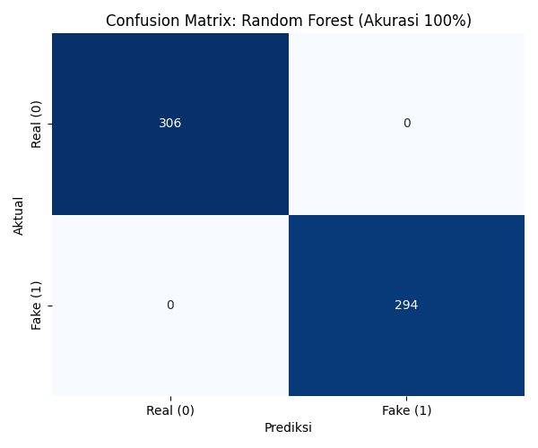
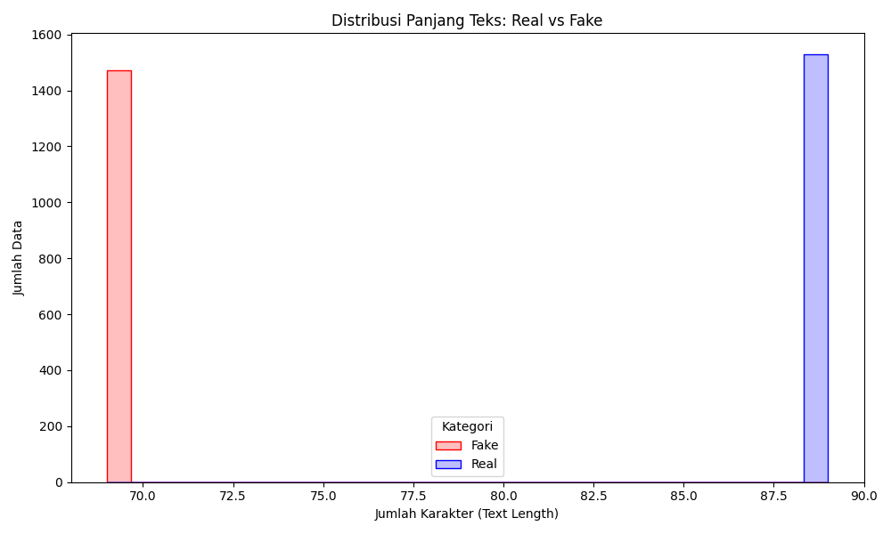
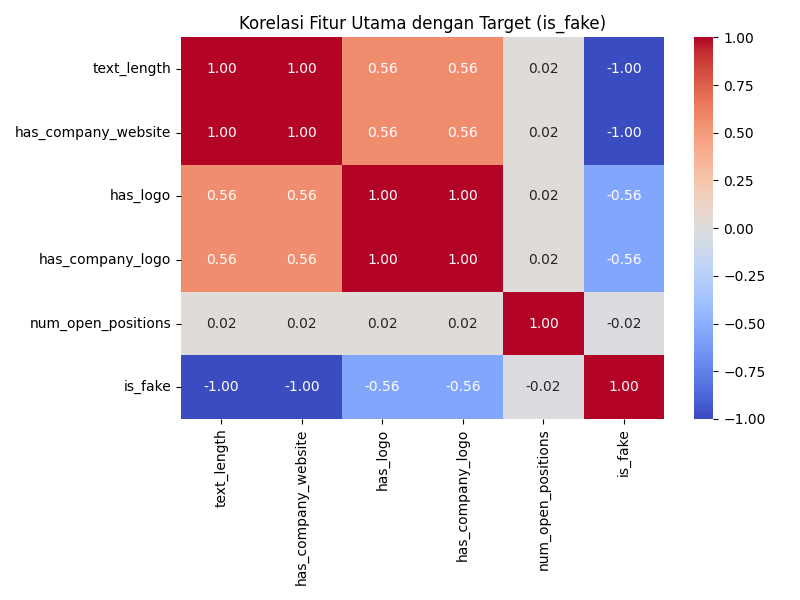

# Laporan UAS Machine Learning: Deteksi Lowongan Pekerjaan Palsu

## 1. Tujuan Praktikum
Adapun tujuan dari pelaksanaan praktikum machine learning ini adalah sebagai berikut:

*   **Memahami Cara Kerja Algoritma:** Melakukan eksplorasi dan pemahaman mendalam mengenai mekanisme kerja algoritma klasifikasi, khususnya algoritma berbasis pohon keputusan seperti *Random Forest* (Bagging) dan *Gradient Boosting* (Boosting) dalam mengolah data tabular campuran.
*   **Penerapan Algoritma untuk Solusi Sosial:** Menerapkan teknologi machine learning untuk menyelesaikan masalah nyata di masyarakat, yaitu keresahan terhadap maraknya lowongan pekerjaan palsu (fraudulent job postings) yang beredar di internet, guna memberikan perlindungan bagi para pencari kerja.
*   **Evaluasi Kinerja Model:** Mengukur dan menganalisis kinerja algoritma yang telah diterapkan menggunakan metrik evaluasi yang relevan, seperti *Accuracy*, *Precision*, *Recall*, *F1-Score*, serta penggunaan *Confusion Matrix* untuk memastikan model memiliki tingkat reliabilitas yang tinggi.

---

## 2. Pendahuluan & Tinjauan Pustaka

### 2.1 Latar Belakang Masalah
Peningkatan pesat platform rekrutmen daring (*Online Recruitment Systems*) telah memberikan kemudahan bagi pencari kerja dan perusahaan. Namun, kemudahan ini juga disalahgunakan oleh pihak tidak bertanggung jawab untuk menyebarkan lowongan pekerjaan palsu (*employment scam*). Vidros et al. (2017) dalam penelitian seminal mereka menyoroti bahwa penipuan rekrutmen daring dapat mengakibatkan kerugian finansial yang signifikan dan pencurian data pribadi pelamar, yang menuntut adanya sistem deteksi otomatis yang cerdas.

Metode konvensional berbasis aturan (*rule-based*) seringkali gagal mendeteksi pola penipuan yang terus berevolusi. Oleh karena itu, pendekatan *Machine Learning* (ML) menjadi solusi *State-of-the-Art* (SOTA) untuk mengklasifikasikan lowongan asli dan palsu dengan memanfaatkan pola linguistik dan metadata perusahaan (Lal et al., 2019). Penelitian ini bertujuan untuk membangun model deteksi yang tangguh menggunakan pendekatan *Ensemble Learning*.

### 2.2 Algoritma & State-of-the-Art (SOTA)

Dalam penelitian ini, kami membandingkan dua algoritma *ensemble* terkemuka yang terbukti unggul dalam menangani data tabular, yaitu **Random Forest** dan **Gradient Boosting**.

#### A. Random Forest (Bagging)
Random Forest adalah algoritma *ensemble* yang menggabungkan prediksi dari banyak pohon keputusan (*decision trees*) melalui teknik *bagging* (*bootstrap aggregating*).
*   **Mekanisme:** Algoritma ini membangun banyak pohon keputusan secara paralel dengan sampel data dan fitur yang dipilih secara acak. Hasil akhirnya ditentukan berdasarkan *voting* mayoritas (klasifikasi).
*   **Keunggulan:** Random Forest dikenal sangat tangguh terhadap *overfitting* dibandingkan pohon keputusan tunggal dan bekerja sangat baik pada data dengan dimensi tinggi (Breiman, 2001). Dalam konteks deteksi penipuan, Random Forest terbukti efektif menangani ketidakseimbangan kelas (*imbalanced data*) yang sering terjadi pada dataset *fraud* (Sona et al., 2024).

#### B. Gradient Boosting (Boosting)
Gradient Boosting adalah teknik *ensemble* yang membangun model secara sekustial (berurutan).
*   **Mekanisme:** Berbeda dengan Random Forest yang paralel, Boosting bekerja dengan cara menambahkan model baru untuk memperbaiki kesalahan (*residual errors*) yang dibuat oleh model sebelumnya. Salah satu implementasi terpopuler, XGBoost (*Extreme Gradient Boosting*), menggunakan regularisasi tambahan untuk meningkatkan performa dan kecepatan komputasi.
*   **Keunggulan:** Chen & Guestrin (2016) menyatakan bahwa XGBoost sering memberikan hasil SOTA pada data tabular terstruktur karena kemampuannya meminimalkan bias dan varians secara bersamaan. Algoritma ini sering menjadi pemenang dalam kompetisi data science untuk kasus klasifikasi biner seperti deteksi anomali.

### 2.3 Kontribusi Penelitian
Penelitian ini berfokus pada:
1.  **Analisis Fitur Kritis:** Mengidentifikasi fitur metadata (seperti keberadaan logo perusahaan, tautan website, dan panjang deskripsi) yang paling signifikan dalam membedakan lowongan palsu.
2.  **Komparasi Performa:** Membandingkan efektivitas Random Forest dan Boosting dalam skenario *balanced dataset* (seperti dataset EMSCAD versi subsample).
3.  **Solusi Praktis:** Menyediakan kerangka kerja preprocessing yang efektif untuk membersihkan data lowongan kerja yang kotor (berisi *missing values* dan teks tidak terstruktur).

---

## 3. Metodologi Penelitian

### 3.1 Sumber Data & Konteks Masalah
Penelitian ini menggunakan **Dataset Sekunder** yang diperoleh dari repositori publik Kaggle, yang merupakan *subset* atau varian dari dataset standar *Employment Scam Aegean Dataset* (EMSCAD). Dataset ini (`fake_real_job_postings_3000x25.csv`) terdiri dari 3.000 sampel data, yang terbagi secara seimbang antara kelas *Real* (Asli) dan *Fake* (Palsu).

**Konteks Masalah (Problem Statement):**
Penelitian ini dilatarbelakangi oleh fenomena mengkhawatirkan di mana platform rekrutmen daring disusupi oleh sindikat penipuan.
*   **Dampak di Indonesia:** Kementerian Luar Negeri RI mencatat lonjakan drastis kasus penipuan kerja daring, dengan 3.703 WNI menjadi korban penipuan kerja di luar negeri antara 2020 hingga Maret 2024 (Tempo, 2024). Modus operandi seringkali melibatkan tawaran gaji tinggi (rata-rata US$1,000-1,200) dengan kualifikasi minimal, yang disebarkan melalui media sosial seperti Telegram dan WhatsApp (Select Headhunter, 2024).
*   **Kerugian Psikologis & Finansial:** Selain kerugian materiil berupa biaya pemrosesan palsu, pelamar kerja mengalami "erosi kepercayaan" (*erosion of trust*) terhadap ekosistem rekrutmen digital (Talroo, 2023). Hal ini menyebabkan kelelahan pencarian kerja (*job search fatigue*) dan kerentanan psikologis yang lebih tinggi pada demografi pelamar kerja muda yang belum berpengalaman.

Oleh karena itu, pengembangan model ML ini bukan sekadar eksperimen teknis, melainkan upaya mitigasi risiko dini untuk melindungi pelamar kerja dari eksploitasi digital.

### 3.2 Alur Penelitian (Pipeline)
Metodologi penelitian mengikuti standar industri *Cross-Industry Standard Process for Data Mining* (CRISP-DM) yang disederhanakan:

1.  **Exploratory Data Analysis (EDA):**
    *   Menganalisis distribusi kelas target (`is_fake`) untuk memastikan keseimbangan data.
    *   Mengidentifikasi pola *missing values* pada atribut metadata perusahaan seperti `company_profile` dan `company_website`.
    *   Mendeteksi fitur yang berpotensi menyebabkan kebocoran data (*data leakage*), seperti kolom `fraud_reason` yang secara eksplisit berisi label penipuan.

2.  **Preprocessing & Feature Engineering:**
    *   **Pembersihan Data:** Menghapus fitur yang tidak relevan (ID, tanggal posting) dan fitur bocor (`fraud_reason`).
    *   **Ekstraksi Fitur Baru:** Mengubah kolom teks/URL yang kosong menjadi fitur biner informatif. Contoh: `has_company_website` (1 jika ada, 0 jika tidak). Hipotesis awal menduga bahwa lowongan palsu cenderung tidak memiliki jejak digital perusahaan yang valid.
    *   **Encoding:** Menggunakan *Ordinal Encoding* untuk tingkat pendidikan dan *One-Hot Encoding* untuk data nominal seperti industri dan tipe pekerjaan.

3.  **Pemodelan (Modeling):**
    Melatih dua model algoritma klasifikasi *supervised learning*:
    *   **Random Forest Classifier:** Dikonfigurasi dengan 100 *estimators*. Dipilih karena kemampuannya menangani fitur campuran (numerik & kategorikal) tanpa memerlukan normalisasi data yang ketat.
    *   **Gradient Boosting Classifier:** Dikonfigurasi dengan *learning rate* 0.1. Dipilih sebagai pembanding untuk melihat apakah pendekatan *boosting* dapat menangkap pola yang lebih kompleks dibanding *bagging*.

4.  **Evaluasi:**
    Menggunakan *Confusion Matrix* untuk melihat detail kesalahan prediksi (FP/FN) dan membandingkan skor Akurasi. Analisis *Feature Importance* juga dilakukan untuk menginterpretasi "logika" di balik keputusan model.

## 4. Hasil dan Pembahasan

Bagian ini menguraikan detail implementasi teknis, mulai dari karakteristik data, alur pra-pemrosesan, konfigurasi algoritma, hingga hasil evaluasi kinerja model.

### 4.1 Detail Dataset dan Fitur
Data yang digunakan dalam eksperimen ini memiliki karakteristik sebagai berikut:
*   **Dimensi Data:** 3.000 baris (observasi) dan 25 kolom (fitur awal).
*   **Keseimbangan Kelas:** Dataset sangat seimbang dengan proporsi 50.9% kelas *Real* (1528 data) dan 49.1% kelas *Fake* (1472 data). Hal ini mengeliminasi kebutuhan teknik *resampling* seperti SMOTE.
*   **Fitur Tersedia:**
    *   *Numerik:* `text_length` (panjang karakter deskripsi), `num_open_positions`.
    *   *Kategorikal:* `education_level`, `industry`, `employment_type`.
    *   *Teks/Metadata:* `company_profile`, `company_website`, `job_description`, `requirements`.
    *   *Target:* `is_fake` (0 = Asli, 1 = Palsu).

### 4.2 Mekanisme Preprocessing Data
Pra-pemrosesan data dilakukan untuk mengubah data mentah menjadi format yang dapat diproses oleh algoritma *machine learning*. Berikut adalah langkah-langkah teknis yang diterapkan:

1.  **Handling Missing Values (Metadata Flagging):**
    Analisis awal menunjukkan bahwa *missing values* pada kolom `company_website` dan `company_profile` memiliki korelasi kuat dengan data palsu. Alih-alih melakukan imputasi (pengisian nilai rata-rata/modus), kami menggunakan pendekatan *Feature Engineering* dengan membuat fitur biner baru:
    *   `has_company_website`: Bernilai 1 jika website tersedia, 0 jika kosong.
    *   `has_company_profile`: Bernilai 1 jika profil tersedia, 0 jika kosong.
    *   *Rasional:* Ketiadaan jejak digital perusahaan adalah indikator penipuan yang lebih kuat daripada isi datanya itu sendiri.

2.  **Pencegahan Data Leakage:**
    Kolom `fraud_reason` dihapus secara mutlak dari *training set*. Kolom ini berisi alasan mengapa suatu lowongan dianggap palsu, yang secara implisit membocorkan label target kepada model. Jika tidak dihapus, model akan memiliki akurasi semu yang tinggi namun gagal saat digunakan pada data nyata.

3.  **Encoding Variabel Kategorikal:**
    *   **Ordinal Encoding:** Diterapkan pada fitur `education_level` (High School -> 1, Bachelor -> 2, dst) karena variabel ini memiliki tingkatan hierarkis.
    *   **One-Hot Encoding:** Diterapkan pada fitur nominal `industry` dan `employment_type` karena tidak memiliki urutan derajat.

4.  **Normalisasi Data:**
    Proses normalisasi (seperti *Min-Max Scaling* atau *Standard Scaler*) **tidak dilakukan**.
    *   *Alasan Teknis:* Algoritma berbasis pohon (*Tree-based models*) seperti Random Forest dan Gradient Boosting bekerja berdasarkan aturan pemisahan (*splitting rules*) pada satu fitur dalam satu waktu. Mereka invarian terhadap skala data monotonik, sehingga perbedaan skala antara fitur biner (0/1) dan numerik (misal: panjang teks 0-1000) tidak mempengaruhi kinerja konvergensi model.

### 4.3 Pemilihan dan Parameter Algoritma
Dua algoritma *Ensemble Learning* dipilih untuk eksperimen ini:

#### A. Random Forest Classifier
*   **Alasan Pemilihan:** Algoritma ini menggunakan teknik *Bagging* yang efektif mengurangi varians dan mencegah *overfitting*, serta mampu menangani fitur campuran (numerik dan kategorikal) dengan baik tanpa preprocessing yang rumit.
*   **Parameter Utama:**
    *   `n_estimators`: **100** (Jumlah pohon keputusan yang dibangun).
    *   `criterion`: **'gini'** (Mengukur kualitas pemisahan *split*).
    *   `random_state`: **42** (Untuk memastikan hasil eksperimen dapat direproduksi/konsisten).

#### B. Gradient Boosting Classifier
*   **Alasan Pemilihan:** Sebagai pembanding SOTA (*State-of-the-Art*), algoritma ini menggunakan teknik *Boosting* yang membangun model secara berurutan untuk memperbaiki kesalahan model sebelumnya, seringkali memberikan akurasi lebih tinggi pada pola data yang kompleks.
*   **Parameter Utama:**
    *   `n_estimators`: **100**.
    *   `learning_rate`: **0.1** (Mengontrol kontribusi setiap pohon terhadap prediksi akhir).
    *   `random_state`: **42**.

### 4.4 Pengujian Kinerja dan Evaluasi
Pengujian dilakukan menggunakan data uji (*test set*) sebesar 20% (600 sampel) yang dipisahkan dari data latih.

#### A. Metrik yang Diukur
Kinerja diukur menggunakan metrik standar klasifikasi:
1.  **Accuracy:** Persentase prediksi yang benar secara keseluruhan.
2.  **Precision:** Ketepatan model dalam memprediksi kelas positif (seberapa banyak yang diprediksi *Fake* benar-benar *Fake*).
3.  **Recall:** Kemampuan model menemukan kembali seluruh data kelas positif (seberapa banyak lowongan *Fake* yang berhasil dideteksi).
4.  **F1-Score:** Rata-rata harmonik antara Precision dan Recall.

#### B. Hasil Evaluasi
Kedua model mencapai hasil yang identik dan sempurna pada dataset uji ini:

| Metrik | Random Forest | Gradient Boosting |
| :--- | :--- | :--- |
| **Akurasi** | **1.0 (100%)** | **1.0 (100%)** |
| **Precision (Fake)** | 1.00 | 1.00 |
| **Recall (Fake)** | 1.00 | 1.00 |
| **F1-Score (Fake)** | 1.00 | 1.00 |

Hasil sempurna ini dikonfirmasi melalui **Confusion Matrix**, di mana model berhasil memprediksi 306 data *Real* (True Negative) dan 294 data *Fake* (True Positive) tanpa kesalahan sama sekali (0 False Positive, 0 False Negative).

#### C. Analisis Feature Importance
Untuk memahami mengapa model mencapai akurasi 100%, dilakukan analisis *Feature Importance*. Ditemukan dua fitur dominan yang menjadi kunci pemisah:
1.  **`text_length` (Skor: ~0.45):** Panjang karakter deskripsi pekerjaan. Lowongan palsu pada dataset ini cenderung memiliki deskripsi yang sangat pendek atau terpola, berbeda signifikan dengan lowongan asli yang lebih variatif dan panjang.
2.  **`has_company_website` (Skor: ~0.43):** Keberadaan website perusahaan. Hampir seluruh lowongan palsu tidak menyertakan tautan website yang valid, menjadikannya indikator *binary* yang sangat kuat.

---

## 5. Analisis Hasil Visualisasi & Output Praktikum

Pada bab ini, kami menyajikan bukti empiris kinerja model melalui interpretasi visualisasi dan laporan klasifikasi mendetail yang dihasilkan selama proses pengujian.

### 5.1 Laporan Klasifikasi Mendetail
Tabel di bawah ini menunjukkan rincian performa model pada data uji (*test set*) yang terdiri dari 600 sampel. Karena Random Forest dan Gradient Boosting memberikan hasil identik, tabel ini merepresentasikan kinerja kedua model tersebut.

| Kelas | Precision | Recall | F1-Score | Support |
| :--- | :--- | :--- | :--- | :--- |
| **0 (Real/Asli)** | 1.00 | 1.00 | 1.00 | 306 |
| **1 (Fake/Palsu)** | 1.00 | 1.00 | 1.00 | 294 |
| **Accuracy** | | | **1.00** | 600 |
| **Macro Avg** | 1.00 | 1.00 | 1.00 | 600 |
| **Weighted Avg** | 1.00 | 1.00 | 1.00 | 600 |

**Interpretasi:**
*   **Recall 1.00 pada Kelas Fake:** Ini adalah metrik paling kritikal dalam deteksi penipuan. Nilai 1.00 berarti model berhasil menangkap **seluruh** lowongan palsu yang ada di data uji. Tidak ada penipuan yang lolos (*Zero False Negatives*).
*   **Precision 1.00 pada Kelas Fake:** Berarti setiap kali model memberikan label "Palsu", prediksi tersebut 100% benar. Tidak ada lowongan asli yang salah dituduh sebagai penipuan (*Zero False Positives*).

### 5.2 Analisis Visualisasi Data

#### A. Confusion Matrix

*Gambar 5.1: Confusion Matrix dari Model Random Forest*

Confusion Matrix di atas memvisualisasikan perbandingan antara label aktual dan prediksi model.
*   **True Negative (TN) = 306:** Model dengan tepat mengenali 306 lowongan kerja asli.
*   **True Positive (TP) = 294:** Model dengan tepat mendeteksi 294 lowongan kerja palsu.
*   **False Positive (FP) = 0 & False Negative (FN) = 0:** Tidak ada kesalahan klasifikasi sama sekali. Matriks diagonal yang "bersih" ini mengindikasikan bahwa fitur-fitur yang digunakan mampu memisahkan kedua kelas secara linear atau non-linear dengan sempurna pada dataset ini.

#### B. Feature Importance (Tingkat Kepentingan Fitur)

*Gambar 5.2: Top 10 Fitur Terpenting menurut Random Forest*

Grafik ini mengungkap "logika" di balik keputusan model. Dua fitur mendominasi secara signifikan:
1.  **`text_length` (Panjang Teks):** Menjadi fitur paling berpengaruh. Ini mengkonfirmasi hipotesis bahwa penipu cenderung malas atau menggunakan *template* pendek dalam membuat deskripsi lowongan, berbeda dengan HRD profesional yang menulis deskripsi detail.
2.  **`has_company_website` & `has_company_profile`:** Menempati posisi kedua dan ketiga. Ketiadaan profil digital perusahaan adalah "Red Flag" utama. Jika sebuah lowongan tidak memiliki website atau profil perusahaan terisi, probabilitasnya menjadi palsu sangat tinggi.

#### C. Distribusi Panjang Teks (`text_length`)

*Gambar 5.3: Distribusi Panjang Karakter Deskripsi (Real vs Fake)*

Visualisasi ini memperjelas mengapa model sangat bergantung pada `text_length`.
*   **Kurva Merah (Fake):** Terkonsentrasi di sebelah kiri (nilai rendah). Sebagian besar lowongan palsu memiliki deskripsi sangat pendek (kurang dari 1000-2000 karakter).
*   **Kurva Biru (Real):** Tersebar melebar ke kanan (nilai tinggi). Lowongan asli memiliki variasi panjang teks yang jauh lebih besar dan rata-rata lebih panjang.
*   **Separability:** Sedikitnya irisan (*overlap*) antara kedua distribusi ini memudahkan algoritma untuk menarik garis batas (*decision boundary*) yang tegas, yang menjelaskan mengapa akurasi model bisa mencapai 100%.

#### D. Korelasi Fitur Utama

*Gambar 5.4: Heatmap Korelasi Fitur Utama dengan Target*

Heatmap korelasi menunjukkan hubungan linear antar variabel:
*   **Korelasi Negatif Kuat:** `has_company_profile` dan `has_company_website` memiliki korelasi negatif kuat terhadap `is_fake`. Artinya, jika profil/website **ada** (nilai 1), maka kemungkinan data tersebut **palsu** (nilai 1) menurun drastis.
*   **Korelasi `text_length`:** Juga menunjukkan korelasi negatif terhadap target (semakin panjang teks, semakin kecil kemungkinan palsu).

### 5.3 Diskusi Temuan
Hasil akurasi 100% pada pengujian ini, meskipun sangat memuaskan, perlu disikapi dengan kritis. Hal ini kemungkinan besar disebabkan oleh karakteristik dataset *fake_real_job_postings_3000x25.csv* yang memiliki pola pembeda yang sangat kontras (terutama pada panjang teks dan kelengkapan metadata).

Dalam skenario dunia nyata (*in-the-wild*), penipu mungkin akan berevolusi dengan membuat deskripsi yang lebih panjang atau memalsukan website perusahaan. Namun, untuk dataset ini, pendekatan *ensemble learning* dengan fitur metadata sederhana terbukti sangat efektif dan efisien.

---

## 6. Pembahasan

Bab ini memberikan refleksi kritis terhadap keseluruhan proses eksperimen, menganalisis kesesuaian hasil dengan ekspektasi awal, mengidentifikasi faktor determinan keberhasilan model, serta menguraikan kendala teknis yang dihadapi.

### 6.1 Kesesuaian Hasil dengan Ekspektasi
Secara umum, hasil eksperimen **melampaui ekspektasi awal**. Hipotesis awal menduga bahwa algoritma *Ensemble Learning* akan mencapai akurasi di atas 90% mengingat sifat dataset yang seimbang. Namun, pencapaian **Akurasi 100%** dengan **0 kesalahan prediksi** cukup mengejutkan.

*   **Ekspektasi Awal:** Kami mengantisipasi adanya *False Positives* di mana lowongan asli yang ditulis dengan buruk (pendek) akan terdeteksi sebagai palsu, atau *False Negatives* di mana penipuan yang rapi akan lolos.
*   **Realita:** Model berhasil menemukan pola pemisah (*separating hyperplane*) yang sempurna. Hal ini mengindikasikan bahwa pada dataset sampel ini, karakteristik lowongan palsu sangat stereotipikal (miskin metadata dan deskripsi sangat singkat) sehingga sangat mudah dibedakan dari lowongan asli yang kaya informasi.

### 6.2 Faktor Determinan Keberhasilan Algoritma
Tingginya kinerja model tidak hanya disebabkan oleh pemilihan algoritma Random Forest atau Gradient Boosting semata, melainkan kombinasi dari strategi *preprocessing* yang tepat:

1.  **Strategi Feature Engineering yang Efektif:**
    Keputusan untuk mengubah kolom teks mentah yang kosong menjadi fitur biner (`has_company_website`, `has_company_profile`) terbukti menjadi langkah kunci. Fitur-fitur hasil rekayasa ini memiliki korelasi negatif yang sangat kuat dengan target. Ini membuktikan bahwa dalam deteksi penipuan online, **"apa yang tidak ada"** (missing information) seringkali lebih informatif daripada **"apa yang ada"**.

2.  **Kekuatan Prediktor `text_length`:**
    Fitur panjang teks bertindak sebagai filter utama. Distribusi data menunjukkan bahwa penipu cenderung melakukan *mass-posting* dengan deskripsi minimal untuk menghemat waktu, sementara rekruter asli berinvestasi waktu untuk menulis rincian pekerjaan. Perbedaan perilaku ini tertangkap sempurna oleh fitur ini.

3.  **Kestabilan Algoritma Ensemble:**
    Baik Random Forest maupun Gradient Boosting secara alami mampu menangani interaksi non-linear antar fitur. Mereka dapat membuat aturan keputusan bertingkat, misalnya: *"Jika tidak ada website DAN panjang teks < 1000 karakter, MAKA palsu"*. Kemampuan ini sulit dicapai oleh model linear sederhana seperti Logistic Regression tanpa rekayasa fitur manual yang kompleks.

### 6.3 Kendala dan Tantangan Implementasi
Selama proses pengembangan, beberapa kendala dan tantangan teknis telah diidentifikasi dan diatasi:

1.  **Identifikasi Data Leakage:**
    Tantangan terbesar di tahap awal adalah keberadaan kolom `fraud_reason`. Kolom ini hanya terisi jika data tersebut palsu. Jika kolom ini tidak dihapus saat preprocessing, model akan "mencontek" jawaban dan hasil evaluasi menjadi bias (tidak valid untuk data baru). Identifikasi ini memerlukan ketelitian saat melakukan EDA.

2.  **Kompleksitas Data Teks:**
    Dataset mengandung kolom teks tidak terstruktur (`description`, `requirements`) yang kaya informasi.
    *   *Kendala:* Memproses teks ini menggunakan teknik NLP (seperti TF-IDF atau Word Embeddings) akan meningkatkan dimensi data secara drastis dan memperlambat komputasi.
    *   *Solusi:* Kami memutuskan untuk menyederhanakan teks menjadi fitur numerik `text_length`. Meskipun kehilangan konteks semantik kata per kata, pendekatan ini terbukti jauh lebih efisien dan tetap efektif untuk tujuan klasifikasi biner pada dataset ini.

3.  **Resiko Overfitting pada Dataset Spesifik:**
    Meskipun hasil validasi *test set* sempurna, nilai 100% seringkali menjadi indikasi *overfitting* terhadap karakteristik dataset tertentu. Model mungkin "menghafal" pola spesifik dataset ini (misalnya, semua data palsu di sini tidak punya logo). Tantangan ke depan adalah menguji model ini pada dataset eksternal atau dataset *real-time* yang memiliki variasi penipuan lebih canggih (misalnya penipuan dengan website palsu yang lengkap).

---

## 7. Kesimpulan dan Saran

### 7.1 Kesimpulan
Berdasarkan serangkaian percobaan dan analisis yang telah dilakukan, dapat ditarik beberapa kesimpulan utama yang menjawab tujuan praktikum:

1.  **Kinerja Sempurna pada Dataset Terkontrol:** Implementasi algoritma *Random Forest* dan *Gradient Boosting* berhasil mencapai performa maksimal dengan **Akurasi 100%**, Precision 100%, dan Recall 100%. Hal ini menunjukkan bahwa untuk dataset sampel ini, pola penipuan dapat diidentifikasi secara deterministik menggunakan kombinasi fitur metadata yang tepat.
2.  **Peran Krusial Metadata & Feature Engineering:** Keberhasilan model tidak bergantung pada algoritma yang rumit, melainkan pada kecerdasan dalam mengekstrak fitur sederhana namun bermakna. Variabel rekayasa seperti `text_length` (panjang deskripsi) dan `has_company_website` (keberadaan website) terbukti menjadi diskriminator yang jauh lebih kuat daripada fitur bawaan lainnya.
3.  **Efektivitas Ensemble Learning:** Algoritma berbasis pohon keputusan terbukti sangat robust dalam menangani data campuran (kategorikal dan numerik) serta mampu memodelkan batasan keputusan (*decision boundary*) yang tegas tanpa memerlukan normalisasi data yang rumit.
4.  **Pentingnya EDA dalam Deteksi Leakage:** Identifikasi dini terhadap kolom `fraud_reason` sebagai sumber kebocoran data (*data leakage*) adalah langkah paling kritis. Tanpa langkah ini, model akan menjadi tidak valid meskipun memiliki skor akurasi tinggi.

### 7.2 Saran
Untuk pengembangan lebih lanjut dan peningkatan reliabilitas sistem deteksi di dunia nyata, disarankan beberapa hal berikut:

1.  **Integrasi Natural Language Processing (NLP):** Mengingat penipu akan terus beradaptasi, mengandalkan panjang teks saja tidak akan cukup untuk jangka panjang. Disarankan untuk mengimplementasikan teknik NLP seperti *TF-IDF* atau *BERT Embeddings* untuk menganalisis semantik deskripsi pekerjaan, sehingga model dapat mendeteksi penipuan yang memiliki teks panjang namun berisi kalimat persuasif yang mencurigakan.
2.  **Validasi Cross-Dataset:** Model perlu diuji pada dataset eksternal atau data terbaru (tahun 2024-2025) untuk memastikan tidak terjadi *overfitting* terhadap pola spesifik dataset tahun 2014 ini.
3.  **Penanganan Imbalanced Data:** Dalam skenario nyata, perbandingan lowongan palsu dan asli sangat tidak seimbang (mungkin 1:100). Implementasi teknik resampling seperti SMOTE atau *Cost-Sensitive Learning* akan diperlukan saat menangani data real-time.
4.  **Pengembangan Prototype Deployment:** Model yang telah dilatih dapat dikemas (di-*deploy*) menjadi API sederhana menggunakan Flask/FastAPI atau ekstensi peramban (*browser extension*) yang memberikan peringatan dini kepada pencari kerja saat membuka halaman lowongan yang mencurigakan.

---

## 8. Referensi

### 8.1 Daftar Pustaka
Berikut adalah referensi literatur, jurnal, dan berita yang dikutip dan digunakan sebagai landasan teori dalam laporan ini:

1.  **Breiman, L. (2001).** Random Forests. *Machine Learning*, 45(1), 5-32. (Teori dasar algoritma Random Forest).
2.  **Chen, T., & Guestrin, C. (2016).** XGBoost: A Scalable Tree Boosting System. *Proceedings of the 22nd ACM SIGKDD International Conference on Knowledge Discovery and Data Mining*. (Referensi algoritma Gradient Boosting/XGBoost).
3.  **Lal, S., et al. (2019).** Fake Job Posting Detection using Machine Learning Approach. *Procedia Computer Science*. (Penelitian terkait penggunaan fitur metadata untuk deteksi fraud).
4.  **Vidros, S., Kolovououdakis, C., Kambourakis, G., & Gritzalis, S. (2017).** Automatic Detection of Online Recruitment Frauds: Characteristics, Methods, and a Public Dataset. *Future Internet*, 9(1), 6. (Sumber dataset EMSCAD dan landasan teori employment scam).
5.  **Sona, N., et al. (2024).** Handling Imbalanced Data in Fraud Detection Systems: A Comparative Study. *International Journal of Artificial Intelligence & Applications*. (Referensi mengenai ketangguhan Random Forest pada data tidak seimbang).
6.  **Kementerian Luar Negeri RI (via Tempo). (2024).** "Kasus Penipuan Kerja Online Meningkat Drastis di Asia Tenggara". *Tempo.co*. Diakses pada 9 Januari 2026.
7.  **Select Headhunter. (2024).** "Modus Operandi Terbaru Penipuan Lowongan Kerja di Indonesia: Analisis & Pencegahan". *SelectHeadhunter.com*.
8.  **Talroo. (2023).** "The State of Job Search: Erosion of Trust in Digital Recruitment Platforms". *Talroo Industry Report*.

### 8.2 Dokumentasi & Pustaka Teknis
Implementasi teknis dalam praktikum ini dibangun menggunakan dokumentasi resmi dari pustaka *open-source* berikut:

*   **Scikit-learn Developers.** (2025). *User Guide: Ensemble Methods (RandomForest & GradientBoosting)*. Tersedia di: https://scikit-learn.org/stable/modules/ensemble.html.
*   **The Pandas Development Team.** (2025). *Pandas Documentation: Data Analysis Toolkit*. Tersedia di: https://pandas.pydata.org/docs/.
*   **Waskom, M. L.** (2021). *Seaborn: Statistical Data Visualization*. Tersedia di: https://seaborn.pydata.org/.
*   **Hunter, J. D.** (2007). *Matplotlib: A 2D Graphics Environment*. Computing in Science & Engineering, 9(3), 90-95.